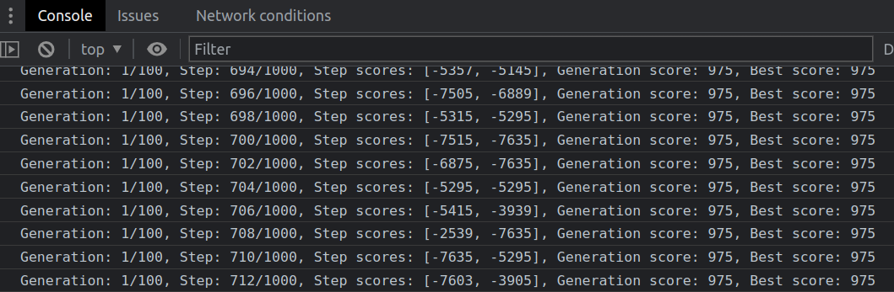
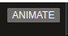
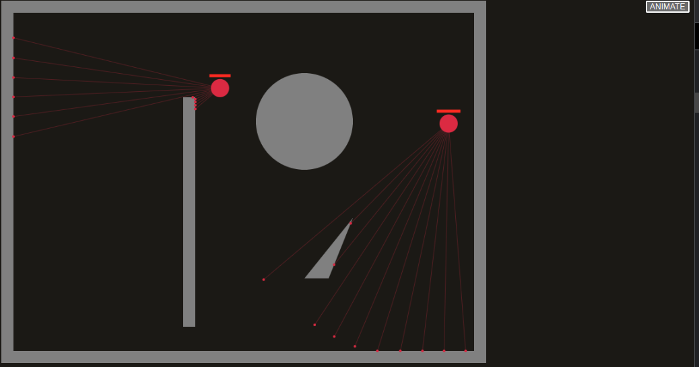

# GFIGHT
### PoC of the neural network AI, trained via genetic algorithm.

It's just a simple demo, the way more comprehensive engine is here: [Crossover](https://github.com/alexeykarnachev/crossover)


## Quick Start
This is a static browser application and could be run via any simple http server
```bash
python3 -m http.server
```
Go to the [localhost:8000](localhost:8000) and check the console.
You'll see that the model is training




Then, you can click the "Animate" button (right top corner)




And watch the current state of the trained AI




